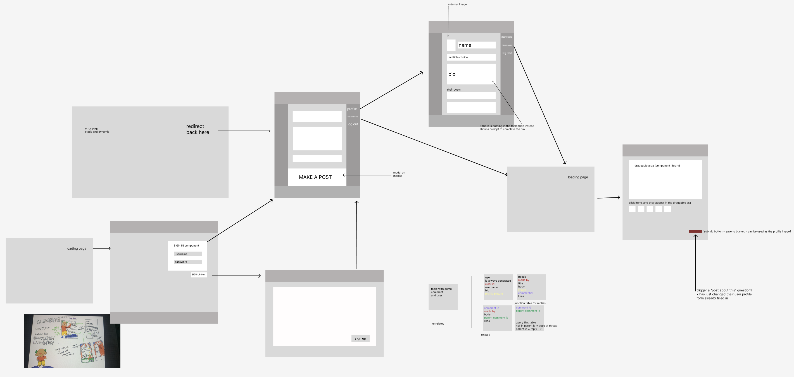
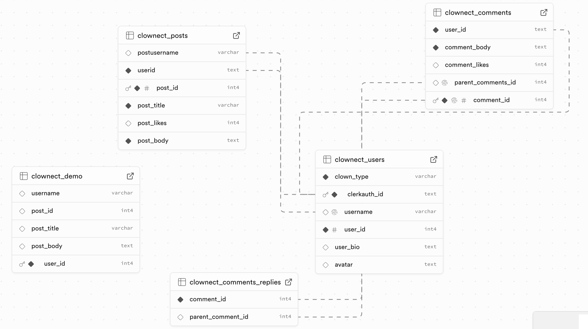

# CLOWNECT

Nothing brings people together like laughter!
Looks like we have some big shoes to fill 🤡

## Aims & Planning

Truthfully, I'm a little intimidated by this assignment. I think it's the mental hurdle of "I have used social media apps" vs past assignments, which are a little less real-world.

In order to help me over the fear/worry of approaching such a big project with so many new additions compared to the projects I have made so far in the course, I once again allowed myself to have fun with the theme / settled on a purposefully out-of-the-box concept so that my design could follow suit and I had an excuse to get just a little more silly in tone than modern social media apps are known for. This hopefully will help me feel distanced from the "real-world" feeling of "what the heck do you mean I'm making a SOCIAL MEDIA APP".

## The Design

Just like last week, I imagined a journey through the app for a user. Unlike last week, it was maybe the most confusing journey anyone could ever have. I want it to feel a little "old-school", including a fake/demo experience when you first sign up, which should allow the user to also start to have an emotional connection with the "personality" of the app.

I once again used Figma to design the wireframes. This week, unlike past weeks, I also visualised a wireframe of my database schema alongside the visual design wireframe in order to make building via SQL more efficient. Again, I am expecting that changes will happen as I progress and either purposefully make a change for a workaround, or realise that the design I am setting out with is not as helpful as it could be.

For the first time, I designed the logic of a comment table, creating a junction table which joins the comment id with the parent comment id (which could be NULL, allowing the comment to be a "top level" comment). An update from the future is that I did not manage to get comments implemented within my app in time for submission, but I am committed to continually working on this app, as I feel that it could become something memorable for my portfolio.

## The Building

Well... how to sum this up!

The building went both more easily than I could have hoped and much more difficult than I feared. I began the assignment in typescript, as during our demo and workshop I liked the idea and working in it felt like it would be rewarding time-wise (with the exception of setting up all the types etc). I think I will attempt to build another app in typescript, either based on the assignment criteria of this week or last week, and make notes of the issues I run into that I may not forsee right now.

In reality, I did not finish my typescript app as I got ill on Friday evening, and when I looked back at my work I had written nonsense thanks to my fever (at least, I will blame my fever) and in the interest of time and salvaging what I could, I started again without typescript.

This week, moreso than even last week, I can feel how my understanding of the necessary logic strengthened (although the results may not reflect that this week, I assure you, there were 0 times I was blank without an idea of where to go next - I know what behaviour I am expecting and understand errors enough to troubleshoot). Anything left undone in the building (such as comments) is simply a result of lack of time. Not to even get into the styling (puppet monkey looking side to side dot gif).

You may have noticed I did not even try images again this week.. that is my one (1) fear, and I've been burned too many times to try and implement them with such limited time currently. However, since this is the week that's designated for skill-building, I'm going to try and deploy an app that exists only to make me less scared of adding images - both local and from external sources.

## Reflections

I think you can see what I was aiming for, and I think I will comfort myself with the idea that I have something to work toward... saying I'm not disapointed would be a lie, but I think I had such big dreams with this one that it never would have been "finished" even if I had the most perfect coding weekend in the world. Ah, to be a dreamer!

Still, similar to last week, I had a blast working on this, from the concepting right down to troubleshooting, and I feel the need to apologise for what I've turned in, because it doesn't feel reflective of that enjoyment. But someday you will get a link to a social media site for clowns that looks suspiciously like exactly how I want it to look ...

## References and Resources

⭐️ <a href="https://icon-icons.com/search/icons/?filtro=clown"> Clown Icon</a>

⭐️ <a href="https://webaim.org/resources/contrastchecker/"> WCAG Contrast Checker</a>

⭐️ <a href ="https://colorhunt.co/palette/eb5353f9d92336ae7c187498">Color Hunt</a>

⭐️ <a href="https://stripesgenerator.com/">CSS Stripes Generator</a>

⭐️ <a href="https://mui.com/joy-ui/react-circular-progress/">MUI Joy</a>

⭐️ <a href="https://clerk.com/docs/testing/test-emails-and-phones">Clerk docs (particularly the testing resources)</a>

⭐️ <a href="https://nextjs.org">Next Docs</a>
